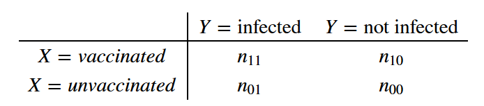
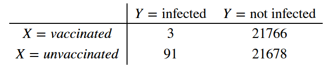
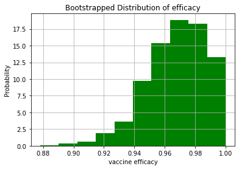

### Corona Vaccine "at least 90 % effective" ?

Pfizer and Biontech [announced](https://www.pfizer.com/news/press-release/press-release-detail/pfizer-and-biontech-announce-vaccine-candidate-against) a breakthrough in the race toward a vaccination against the Corona virus:

> "The case split between vaccinated individuals and those who received the placebo indicates a vaccine efficacy rate above 90%, at 7 days after the second dose. This means that protection is achieved 28 days after the initiation of the vaccination, which consists of a 2-dose schedule."

The **efficacy** is [defined](
https://www.cdc.gov/csels/dsepd/ss1978/lesson3/section6.html
) as one minus the relative risk ratio:

$$
efficacy =1- \frac{risk_{vaccinated}}{risk_{unvaccinated}} 
$$

Despite a lengthy search, I was unable to find more information than the following numbers:

> Study enrolled 43,538 participants, 94 confirmed cases of COVID-19 in trial participants. 

I wished I could find data on the 2x2 table.
"**At least 90%**" efficacy suggests to me that this is a lower bound on a confidence interval. For rare diseases, the relative risk is approximately equal to the  [odds ratio](https://en.wikipedia.org/wiki/Odds_ratio). Starting from a contingency table 



a confidence interval for the log odds
is approximately equal to

$$
\log(OR) - 1.96 \sqrt{\dfrac{1}{n_{11}} + \dfrac{1}{n_{10}} + \dfrac{1}{n_{01}} + \dfrac{1}{n_{00}}}
$$


So for an even split of placebo/vaccination among the 43,538 enrolled, the upper bound of the CI (for the odds ratio) for e.g. $3$ of $94$ infected people having been vaccinated is (yes, we could omit the last two fractions):

$$
\exp{\left(\log(3/91) + 1.96 \sqrt{\dfrac{1}{3} + \dfrac{1}{91} + \dfrac{1}{21678} + \dfrac{1}{21766}} \right)} \approx 0.1
$$

which would lead to a lower bound of the vaccine efficiency of 90% ($=1-0.1$).
So I am concluding that the 2x2 table looked like this




```python
import numpy as np
import matplotlib.pyplot as plt

CIupper = np.exp(np.log(3/91) + 1.96*np.sqrt(1/3 + 1/91 + 1/21678 + 1/21766))
np.round(CIupper,2)
```


    0.1


### Bootstrap based CI

Instead of relying on the approximation of a parametric confidence interval, we can draw "many" bootstrapped samples of the data and estimate the CI of the relative risk directly.


```python
def bootstrap_replicate_1d(data, func):
    return func(np.random.choice(data, size=len(data)))

def draw_bs_reps(data, func, size=1):
    """Draw bootstrap replicates."""

    # Initialize array of replicates: bs_replicates
    bs_replicates = np.empty(size)

    # Generate replicates
    for i in range(size):
        bs_replicates[i] = bootstrap_replicate_1d(data, func)

    return bs_replicates
```


```python
M=1000

# Construct arrays of data: 
Vaccinated = np.array([True] * 3 + [False] * (21769 - 3))
NotVaccinated = np.array([True] * 91 + [False] * (21769 - 91))

# Compute 1,000 bootstrap replicates from shifted arrays
bs_replicates_V = draw_bs_reps(Vaccinated, np.sum, size=M)
bs_replicates_NV = draw_bs_reps(NotVaccinated, np.sum, size=M)

#relative risks:
RR =bs_replicates_V/bs_replicates_NV
```


```python
tmp=plt.hist(1-RR,density=True, facecolor='g')
plt.xlabel('vaccine efficacy')
plt.ylabel('Probability')
plt.title('Bootstrapped Distribution of efficacy')
plt.grid(True)
plt.show()
#LowerBoundEfficiency 
np.round(np.quantile(1-RR,0.025),3)
```





    0.924


So, the nonparametric confidence interval is more optimistic and yields a lower bound of **92.4 %** vaccine efficiency.


```python
np.quantile(RR,0.975)-np.quantile(RR,0.025)
```


    0.0759923804842079


